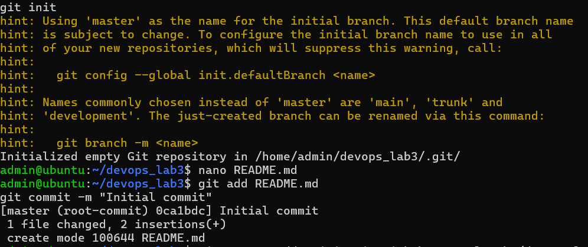
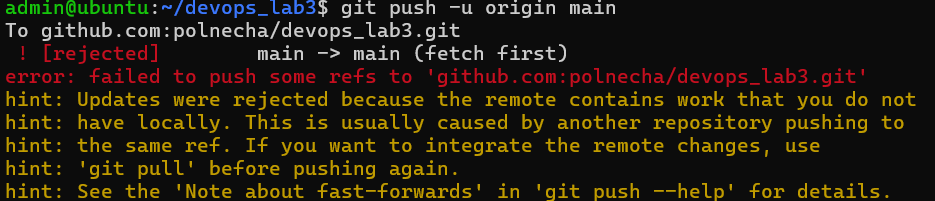
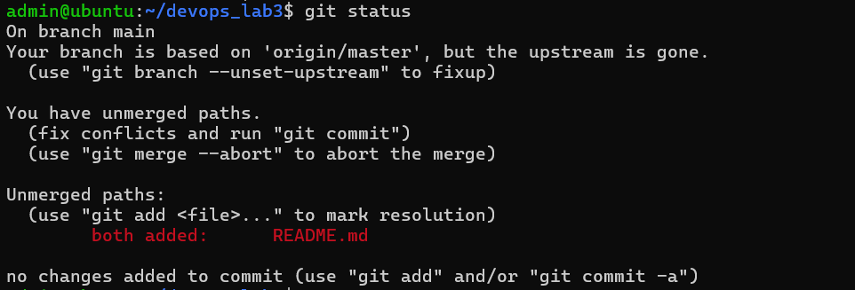
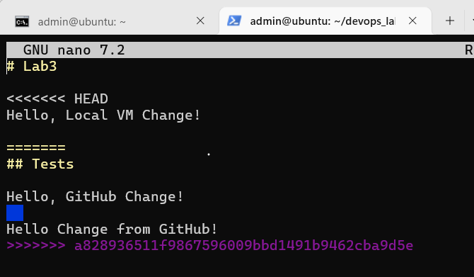
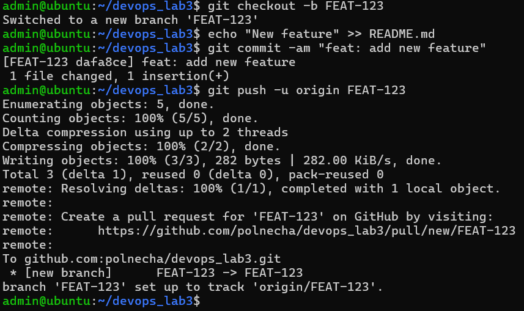

# Лабораторная работа №3: Git

## Описание
Изучение системы контроля версий Git: локальная работа, подключение к удалённому репозиторию по SSH, разрешение конфликтов слияния и работа с ветками.

## Выполненные задачи
1. Сгенерирован SSH-ключ `id_ed25519_git` и добавлен в профиль GitHub.
2. Настроен Git (имя пользователя и email).
3. Создан локальный репозиторий `devops_lab3` с файлом `README.md`.
4. Подключен удалённый репозиторий по SSH (`git@github.com:polnecha/devops_lab3.git`).
5. Отработан механизм разрешения конфликтов слияния:
   - Получена ошибка `[rejected]` при попытке push.
   - Выполнен `git pull` с флагом `--allow-unrelated-histories`.
   - Вручную разрешён конфликт в `README.md` (удалены маркеры `<<<<<<<`, `=======`, `>>>>>>>`).
6. Создана новая ветка `FEAT-123`, внесены изменения и отправлены на сервер.

## Использованные команды
- `ssh-keygen`, `ssh -T git@github.com`
- `git init`, `git add`, `git commit`
- `git remote add origin`, `git push`, `git pull`
- `git config pull.rebase false`
- `git checkout -b`, `git merge` (автоматический при pull)
- `git status`

## Демонстрация результатов

### 1. Инициализация репозитория и первый коммит

### 2. Ошибка push (конфликт с удалённым репозиторием)

### 3. Статус конфликта (both modified)

### 4. Маркеры конфликта в файле README.md

### 5. Создание и отправка ветки FEAT-123

